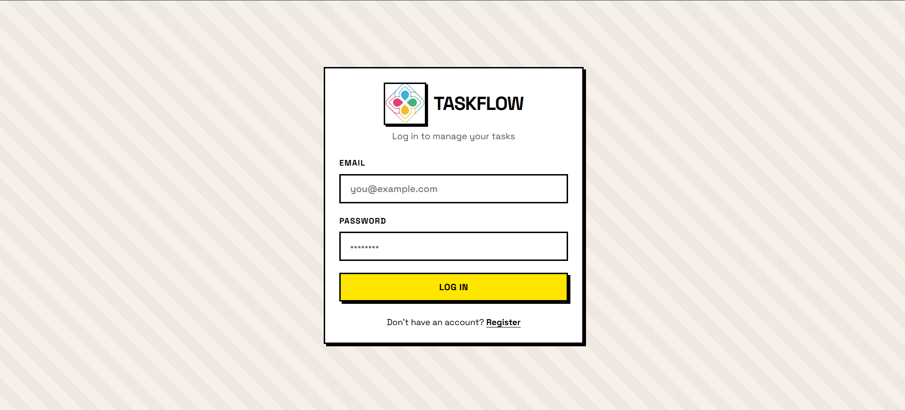
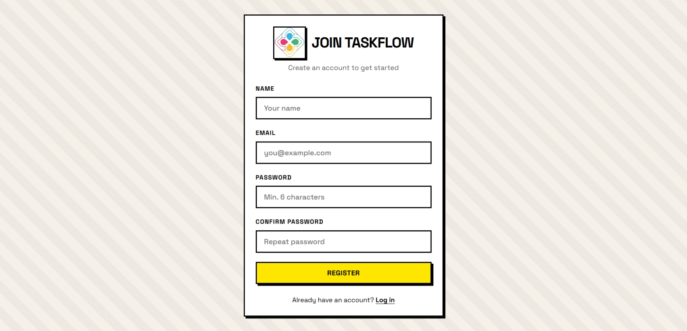
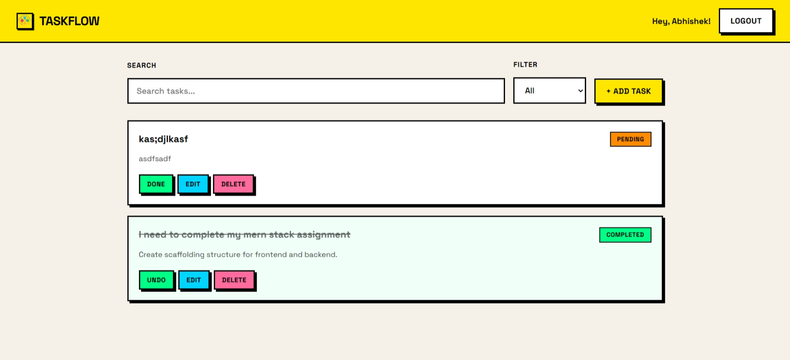

# TaskFlow - MERN Task Management App

<p align="center">
  
</p>

A full-stack task management application built with the MERN stack, featuring a **Neobrutalism** (Neo-Brutalist) UI design.

## Preview





## Features

- **Authentication** — User registration and login with JWT
- **Task CRUD** — Create, read, update, and delete tasks
- **Status Toggle** — Mark tasks as pending or completed
- **Search & Filter** — Search by title/description, filter by status
- **Pagination** — Paginated task list
- **Form Validation** — Client and server-side validation
- **Edge Case Handling** — Comprehensive error handling on the backend

## Tech Stack

| Layer    | Technology                          |
|----------|-------------------------------------|
| Frontend | React.js, React Router, Axios, Vite |
| Backend  | Node.js, Express.js, JWT            |
| Database | MongoDB Atlas (Mongoose)            |

## Project Structure

```
Mern-assignment/
├── backend/
│   ├── config/         # Database connection
│   ├── middleware/     # Auth, validation, error handling
│   ├── models/         # User & Task schemas
│   ├── routes/         # Auth & task API routes
│   └── server.js
├── frontend/
│   └── src/
│       ├── api/        # Axios API calls
│       ├── components/ # Reusable UI components
│       ├── context/    # Auth context
│       ├── pages/      # Login, Register, Dashboard
│       └── utils/      # Form validation helpers
└── README.md
```

## Setup Instructions

### Prerequisites

- Node.js (v18+)
- MongoDB Atlas account (connection string configured)

### 1. Clone the repository

```bash
git clone <your-repo-url>
cd Mern-assignment
```

### 2. Backend setup

```bash
cd backend
npm install
```

Create a `.env` file in the `backend` folder (or use the existing one):

```env
PORT=5000
MONGODB_URI=mongodb+srv://<username>:<password>@cluster0.xxxxx.mongodb.net/taskmanager?retryWrites=true&w=majority
JWT_SECRET=your_super_secret_jwt_key
JWT_EXPIRE=7d
```

Start the backend:

```bash
npm run dev
```

The API runs at `http://localhost:5000`.

### 3. Frontend setup

Open a new terminal:

```bash
cd frontend
npm install
npm run dev
```

The app runs at `http://localhost:3000`.

## API Endpoints

### Auth

| Method | Endpoint            | Description       | Auth |
|--------|---------------------|-------------------|------|
| POST   | `/api/auth/register`| Register user     | No   |
| POST   | `/api/auth/login`   | Login user        | No   |
| GET    | `/api/auth/me`      | Get current user  | Yes  |

### Tasks

| Method | Endpoint                | Description          | Auth |
|--------|-------------------------|----------------------|------|
| GET    | `/api/tasks`            | List tasks (paginated, searchable) | Yes |
| GET    | `/api/tasks/:id`        | Get single task      | Yes  |
| POST   | `/api/tasks`            | Create task          | Yes  |
| PUT    | `/api/tasks/:id`        | Update task          | Yes  |
| PATCH  | `/api/tasks/:id/toggle`  | Toggle task status   | Yes  |
| DELETE | `/api/tasks/:id`        | Delete task          | Yes  |

### Query Parameters (GET /api/tasks)

- `page` — Page number (default: 1)
- `limit` — Items per page (default: 10, max: 50)
- `status` — Filter: `pending`, `completed`, or `all`
- `search` — Search in title and description

## Design — Neobrutalism

The UI follows the **Neobrutalism** design trend:

- Thick black borders (3px)
- Hard offset box shadows (no blur)
- Bold, high-contrast colors (yellow, pink, cyan, green)
- Space Grotesk typography
- Uppercase labels and buttons
- Raw, unpolished aesthetic with intentional "brutal" styling

## Error Handling (Backend Edge Cases)

- Duplicate email on registration
- Invalid credentials on login
- Missing/invalid JWT token
- Expired token
- User not found (deleted after token issued)
- Task not found or not owned by user
- Invalid MongoDB ObjectId
- Empty update payloads
- Invalid status values
- Mongoose validation errors
- 404 for unknown routes

## Assets & Demo

- **Video demo:** embedded from the local repo.

	<video src="frontend/public/taskflow_video.mp4" controls width="800">Your browser does not support the video tag.</video>

- **Screenshots:**

	
	
	

- **Logo:**

	

- **File locations:**
	- Video: `frontend/public/taskflow_video.mp4`
	- Screenshots: `frontend/src/assets/login.png`, `frontend/src/assets/register.png`, `frontend/src/assets/app.png`
	- Logo: `frontend/src/assets/logo.png`

- **How to update assets:**
	1. Copy the video to `frontend/public/taskflow_video.mp4`.
	2. Copy screenshots and logo to `frontend/src/assets/`.
	3. Commit and push the files.

## Author
Vishalkirthik Thirukkonda
MERN Stack Internship Assignment
